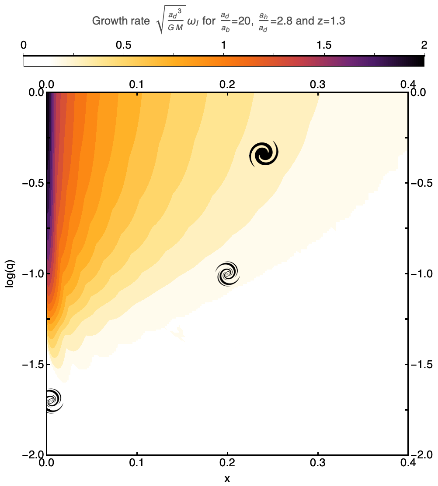

# LiRA

Linear Response of (galactic) Arms

## Aim of the code

This code aims to compute the growth rate of the arms of a thin Kuzmin-Toomre galactic disc, influence by the presence of two Toomre sphere potential modeling a central bulge and a surrounding dark matter halo.

Used in Reddish et al. (2021) : [arXiv:2106.02622](https://arxiv.org/pdf/2106.02622.pdf).



## Modeling

Following Aoki et al (1979), we consider thin disk made of polytropic gas with index 4/3, which gives analytical expression for the response matrix elements.
The implementation of the bulge component and of the self-gravity parameter slightly modify those matrix elements, which we implement in this semi-analytical code.

## Julia packages

Open the terminal in the folder `packages` and type

```
$ julia Install-pkg.jl
```

to install the following packages:

- `HDF5`
- `ArgParse`
- `Plots`
- `LinearAlgebra`
- `StaticArrays`
- `SphericalHarmonics`

### !! WARNING !!

**DO NOT INTERRUPT THE DOWNLOADING OF THE PACKAGES !!!!**

## Plot a growth rate map in (x,q) space

To compute a mapping of the system growth rate, one needs to open 
`code/tests`.

Then, run the command 

```
$ julia MapGrowthRateAndPrecession.jl
```

within the folder `code/tests`. If one wants to run this with parallelization,
one needs to run the following commands (supposing one is using bash)

```
$ export JULIA_NUM_THREADS=12
$ export JULIA_CPU_THREADS=12
$ julia -p 12 MapGrowthRateAndPrecession.jl --parallel yes --eps 0.1 --N 170 --m 2
```

where 12 is the number of parallelized threads. One can check the number of 
threads by opening the Julia terminal and by running the command

```
julia> Threads.nthreads()
```

The resulting file will be created in the folder `code/data` under the name 
`Dump_Growth_Rate_Precession.hf5`.

Go to the folder `code/nb` and open the Mathematica notebook
`GrowthRate.m`. Use it to plot and save the map in (x,q) space in the folder
`code/graphs` under the name `GrowthRate.png` (contour plot) and `GrowthRate3D.png` (3D plot).

One may also plot the precession frequency of the fastest growing mode using this notebook, and recover
the plotd under the names `PrecessionFrequency.png` and `PrecessionFrequency3D.png`.

## Plot the physical eigenvalues in a Nyquist diagram

To compute the physical eigenvalues of the system, one needs to open 
`code/tests/ComputeEigenvalues.jl` and specify the values of `x` - Mbulge/(Mbulge+Mdisk) - 
and `q` Mdisk/(Mhalo+Mdisk) in the file.

Then, run the command 

```
$ julia ComputeEigenvalues.jl
```

within the folder `code/tests`. If one wants to run this with additional arguments,
one needs to run the following command

```
$ julia ComputeEigenvalues.jl --eps 0.1 --N 170 --m 2
```

The resulting file will be created in the folder `code/data` under the name 
`Dump_Eigenvalues.hf5`.

Go to the folder `code/nb` and open the Mathematica notebook
`Eigenvalues.m`. Use it to plot and save the Nyquist in the folder
`code/graphs` under the name `Eigenvalues.png` (all eigenvalues of the truncated response matrix)
and `Physical_Eigenvalues.png` (physical eigenvalues of the truncated response matrix).
